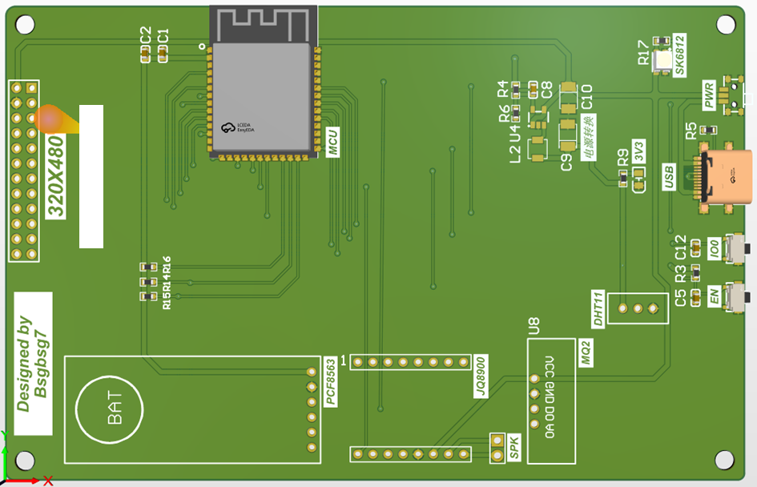

# 崇新学堂开放创新实践硬件项目Shiroe（名字取自《记录的地平线》😋😋，嵌软也有挺多好玩的其实🤣🤣）

## 功能展示

## 一、已实现的功能

>- 当前的年、月、日、时、分、秒显示
>- 设置年、月、日、时、分、秒
>- AM、 PM 设置与显示
>- 农历年月日、二十四节气显示
>- 闹钟时间设置，闹钟时间到进行声光报警提示
>- 温湿度检测与显示
>- 闹钟音乐选择（采用 TF 卡或录音芯片存储音乐数据）
>- 手机通过蓝牙或 WiFi 网络连接该万年历，通过手机 APP 可以完成基本功能中的所有设置功能
>- 通过编写 Android 手机程序获得网上天气预报数据，并将该数据通过蓝牙或WiFi 网络传递给音乐万年历，万年历可以完成天气信息显示
>- 火灾检测与报警，采用声光报警和发送邮件的形式提醒
>- 电脑状态监测，实时监控电脑CPU、GPU状态
>- Bilibili用户数据实时显示
>- 系统菜单界面

## 二、 硬件设计

### （1）原理图设计及其各模块简介

**主控：** ESP32-S3-WROOM-1(N16R8)模组，内置2.4GHz WiFi以及低功耗蓝牙，双核 32 位 LX7 微处理器，高达 240 MHz 的时钟频率， 384 KB ROM ，512 KB SRAM ，16MB Flash，8MB PSRAM。

**电源转换：**SY8089A1AAC同步降压DC/DC稳压器，能够提供高达2A的输出电流，可以在2.5V到5.5V的宽输入电压范围内工作，输出电压纹波小，外接电感小。

**显示屏：**ST7789V电容触摸屏，采用8位并口模式通信。

**时钟芯片：** PCF8563模块，支持IIC通信，配有CR1220备用电池以及二极管保证任何时候都有一个供电。

**烟雾检测模块：**MQ2模块。

**音乐模块：**JQ8900模块，采用特有的一线控制模式，5V供电，通过导线外接8W 0.5Ω的喇叭。

**温湿度模块：**DHT11模块。

**彩灯：**SK6812RGB彩灯。

**USB**：Type-C USB。

### （2）印制板图设计

## 三、软件设计

​	代码基于Arduino框架，采用LVGL图形库，不同App的页面主要采用GUI Guider软件设计，自动生成代码后移植到工程框架下，页面之间的切换逻辑采用链表连接，根据设定的交互逻辑，自动切换链表指针位置到下一个页面（展开新页面），或回到上一个位置（返回上一个页面）并释放内存。

​	其中，各个app页面的设计如下：

​	**主页面：**开机初始化联网获取时间并写入pcf8563，通过心知天气api接口获取天气并显示，通过定时器定时读取pcf8563时间，每十分钟获取一次天气，读取dht11数据，获取电脑状态数据，并刷新显示。同时不断检测闹钟和烟雾报警，做出响应。

​	**闹钟：**定时器每隔一段时间给jq8900发送指令（发送的时间很短，发送后会自动播放）播放音乐，同时页面添加回调函数检测用户操作（推迟、关闭），返回主页。

​	**烟雾警报**：检测到MQ2低电平报警，定时器为jq8900发送音乐播放指令，同时通过smtp协议向手机发送报警邮件。

​	**农历：**初始化获取pcf8563时间，通过内置的算法转换为农历日期以及节气、生肖，定时器通过心知天气api获取建议，显示生肖对应的图片。

​	**手机App控制：**App采用App Inventor设计，利用巴法云物联网开放平台，使用mqtt协议通信，实时显示订阅收到的时间、闹钟、音乐选择、am/pm设置、天气等信息，并设置。

​	**设置：**组件通过全局变量获取数据，保证显示数据为目前的设置情况，添加对应回调函数，用户可以通过点击键盘、开关等操作修改设置，点击确认按钮修改全局变量完成设置。

​	**Bilibili**：通过Bilibili开放Api获取用户信息并显示。

## 四、总结

### 1、硬件设计

​	一开始电源转换选择不合理，pcb绘制等出现了很多问题，感谢老师的耐心指导和纠正。设计第一版pcb出现了许多问题：

**初版pcb：**

>- FPC排座焊接困难，由于焊接技术不够，fpc出现连锡后刀头怎么都刮不下来。
>- 最开始考虑使用的屏幕过于古老，虽然有开源的基于esp-idf框架的驱动移植代码，但开始高估了自身，完全看不懂此框架下的代码，咨询过后发现重新抑制驱动与lvgl到Arduino框架下过于困难，去掉了屏幕部分，更换为屏幕模块。
>- 芯片无法正常启动，不断重启，在实验室测了一晚上bug，才找到问题。引脚分配不合理，将IO46用于IIC通信，加了上拉电阻，导致芯片无法正常启动（系统启动需要IO46低电平）。

### 2、软件：

1) #### LVGL不会用

​	但似乎看着看着，需要用的时候去官网查查就会用了。

2) #### GUI Guider生成代码的移植 

​	手动敲ui过于复杂，选择使用恩智浦开发的GUI Guider LVGL页面设计工具，但是网上关于这部分移植并未有太多资料，尝试所有能找到的博客也未能复现，也是忐忐忑忑地摸索了两天才弄清楚怎么移植，才能安心使用LVGL来设计页面。

​	具体的移植过程比较复杂，不在此处详细说明，已经发布到我的博客上[《恩智浦 Gui Guider + Platformio + ESP32S3 移植测试》](https://blog.szbsgbsg7.top/2023/05/31/cx-lvgl-4/)。

3) #### UI页面交互逻辑不会设计

​	使用LVGL设计页面都完成了，但是不同页面之间如何切换，这个问题困扰了很久，此处感谢[T-Rex1000/DeskAssistant2.0 (github.com)](https://github.com/T-Rex1000/DeskAssistant2.0)的开源代码，

​	在细致地学习了此代码中的页面交互逻辑后，仿照完成了此万年历交互的设计，即使用lv_src_load() 函数加载页面，各个app的页面函数中返回lv_obj_t* 类型的页面，再加上“亿点细节”，就可以完成页面切换了。

4) #### 主控触发看门狗重启

​	这是此项目中最麻烦的问题，期末时对着不停重启的主控修了两天，一项项排查问题，才找到方法。导致此问题的原因很多，大部分都是指针、地址、内存溢出等导致，此处仅列出几种此项目中遇到的情况及解决方案。

​	**不合理的指针使用导致的重启：**

​	LVGL涉及非常多的指针，一不注意就可能会出错。可以看到，对于自己创建的指针组合成的结构体，在定时器传递参数时必须转换为指针。而对于LVGL创建的组件，由于本身就是指针，传递时传递本身即可。此处出现问题不会报错，但是会在不正常运行或者重启，一定要谨慎。

​	**定时器导致的重启：**

​	LVGL页面切换必须使用lv_timer_del() 函数删除当前页面的所有定时器，否则会导致重启（具体原因暂时未知），因此定时器需要定义为全局变量，在页面切换时非常谨慎、合理地删除或者创建，连接页面交互的链表也要在合适的时候使用free() 释放地址空间。

5) #### 重定义问题

​	这个问题最后也不知道是哪里导致的，产生了很多奇奇怪怪的bug，最后代码写在一个文件中才解决，其中一个可能的原因为多个文件中定义，逻辑要清楚，头文件注意不要嵌套调用（实测也不一定是这个导致）。

6) #### 未来改进的方向：

​	  此项目代码是在裸机上运行，纯粹的LVGL+定时器，可能会有页面卡死的情况，原开源作者的LVGL页面交互是基于FreeRTOS操作系统的，建议后续上操作系统，应该能够很好地解决这个问题。

​	  此项目挖了很多坑，目前仅停留在“能跑”，能作为一个入门硬件几个月的成果，后续有时间会学习并优化硬件和软件。
 	
​	
 
